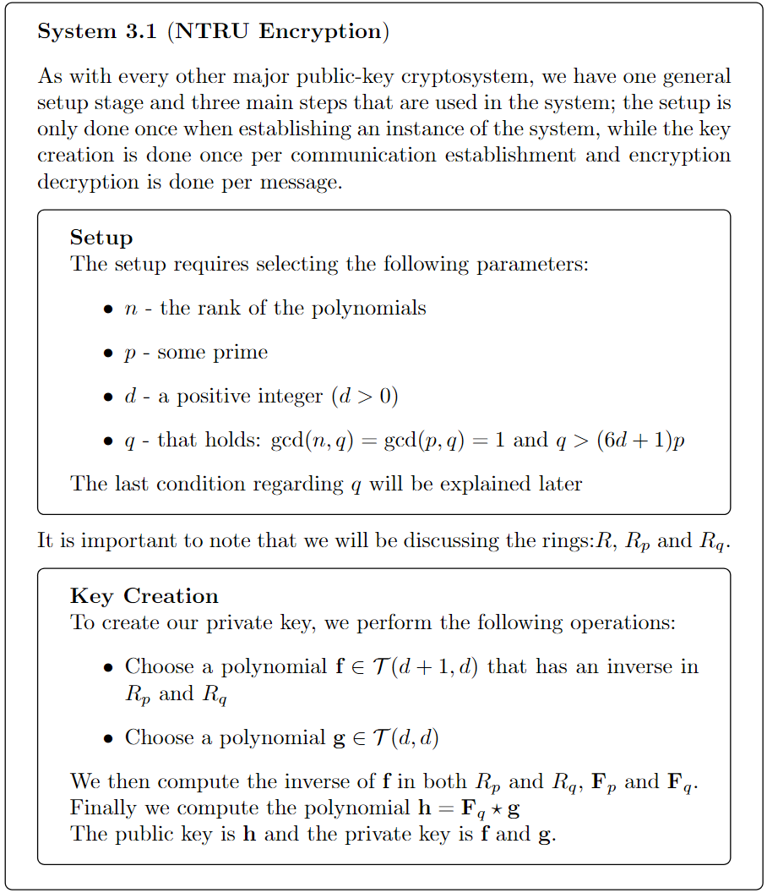
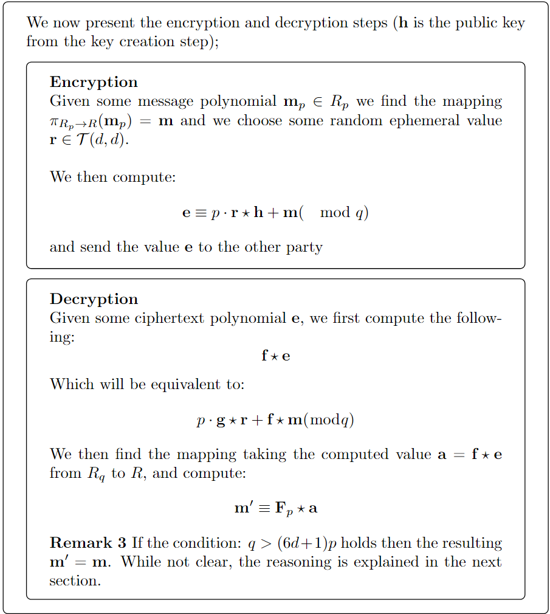
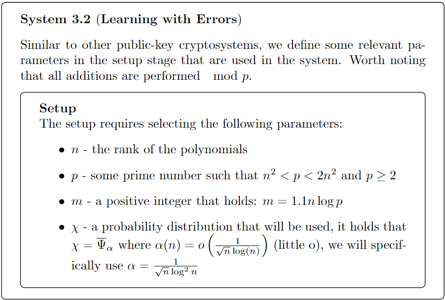
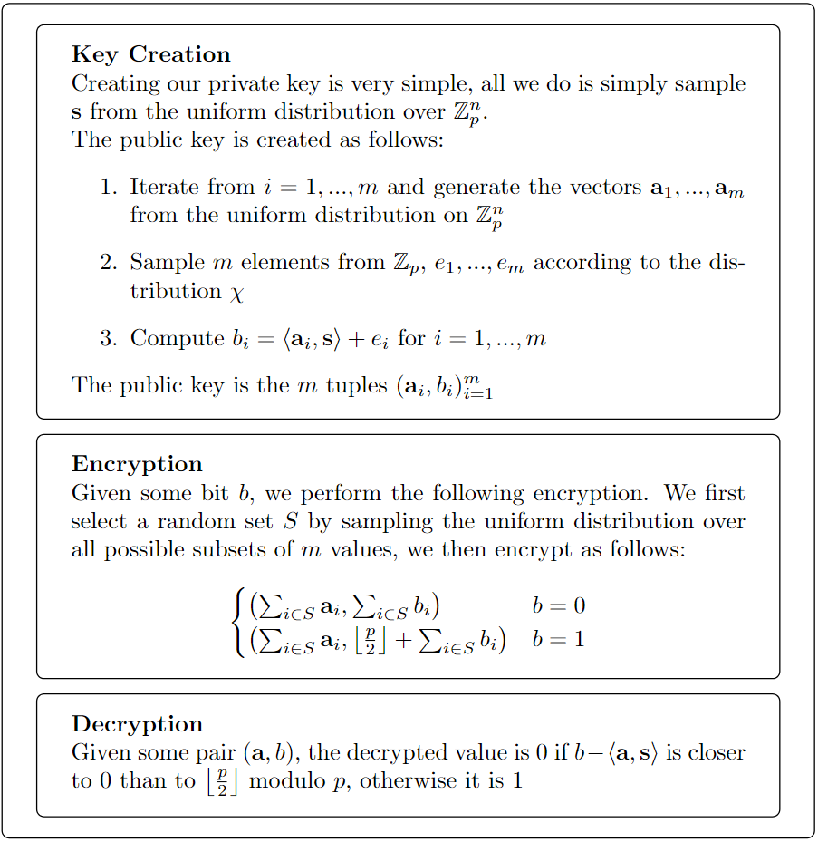
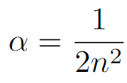

# PQCS
Post-Quantum Crypto System Implementation in Python for Seminar Paper @ OpenU IL

## NTRU
NTRU Cryptosystem was added according to the following definitions:

## Learning with Errors (LWE)
LWE Cryptosystem as added according to the following definitions:

**Note** - the equation selected for LWE is:

This was done to ensure that the errors generated from the distribution are within the expected range.